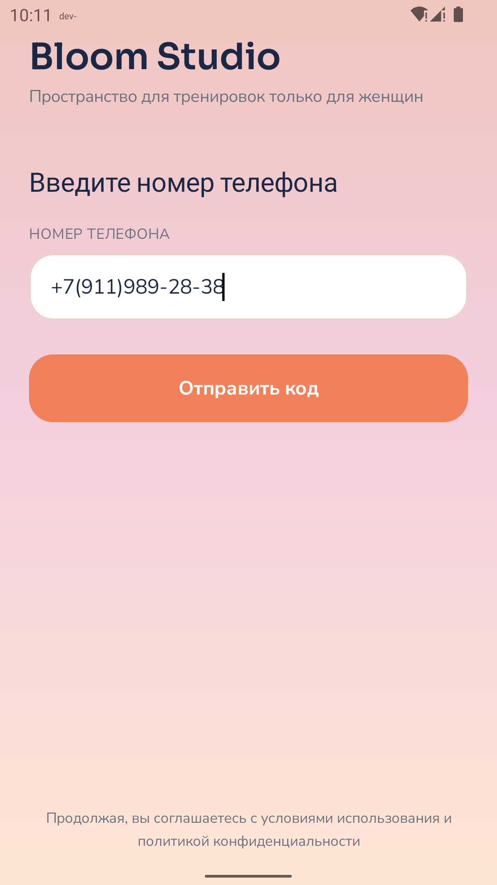
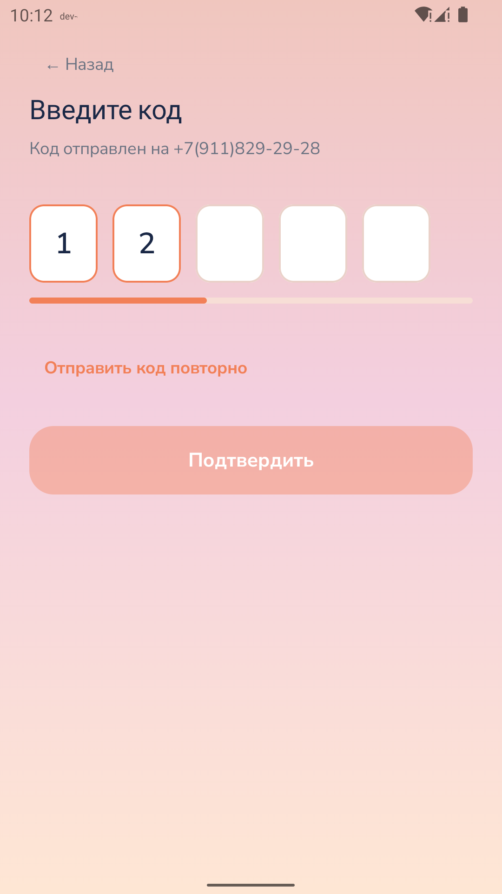
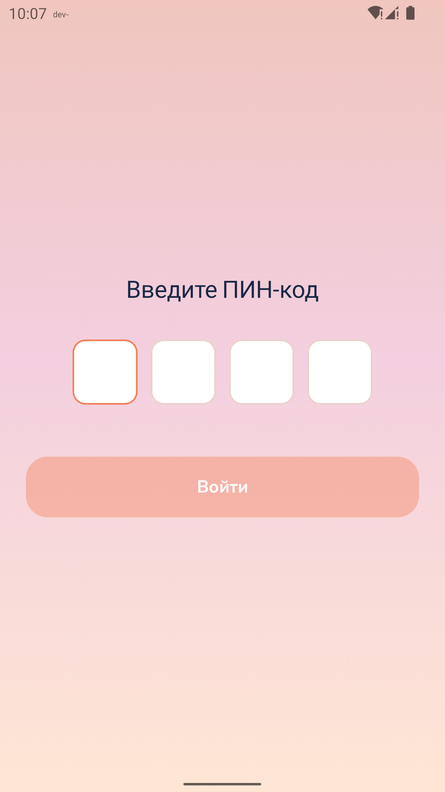
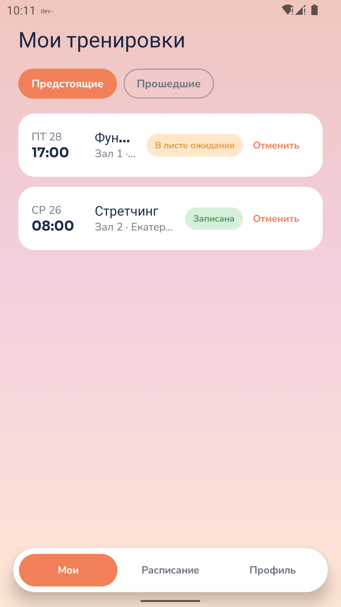
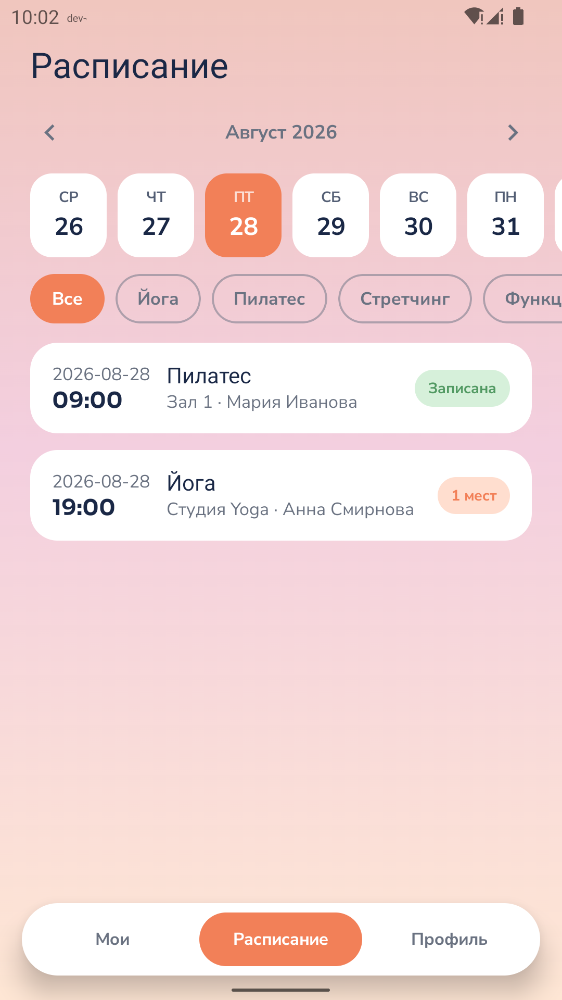
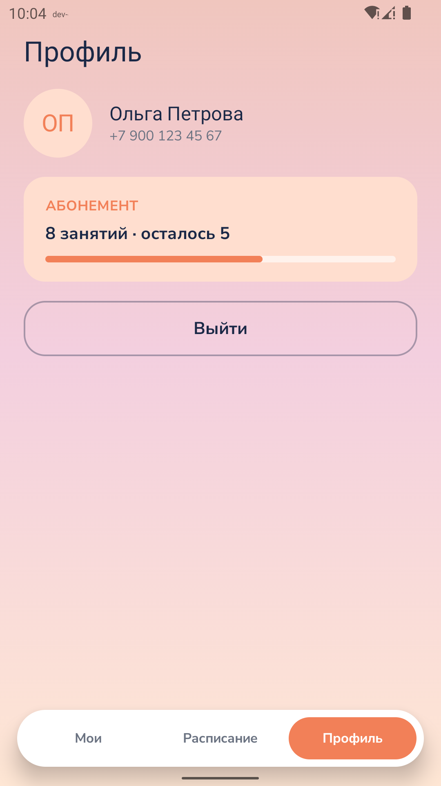

# Приложение студии йоги и фитнеса

Android-приложение для управления расписанием тренировок.

## Скриншоты

<table>
  <tr>
    <td></td>
    <td></td>
    <td></td>
  </tr>
  <tr>
    <td align="center">Ввод телефона</td>
    <td align="center">СМС код</td>
    <td align="center">ПИН-код</td>
  </tr>
  <tr>
    <td></td>
    <td></td>
    <td></td>
  </tr>
  <tr>
    <td align="center">Мои занятия</td>
    <td align="center">Расписание</td>
    <td align="center">Профиль</td>
  </tr>
</table>

## Стек технологий

*   **Язык**: [Kotlin](https://kotlinlang.org/)
*   **UI**: [Jetpack Compose](https://developer.android.com/jetpack/compose)
*   **Навигация**: [Navigation 3](https://developer.android.com/guide/navigation/navigation-3) 
*   **Внедрение зависимостей**: [Dagger 2](https://dagger.dev/)
*   **Сеть**: [Retrofit](https://square.github.io/retrofit/) + [OkHttp](https://square.github.io/okhttp/)
*   **Архитектура**: Clean Architecture
*   **Статический анализ**: [Detekt](https://detekt.dev/)

## 🛠 Архитектура проекта

Проект разделен на модули для обеспечения масштабируемости и разделения ответственности:

*   **`:app`**: Точка входа
*   **`:core`**: Общие компоненты.
    *   `:core:data`: Реализация репозиториев, управление сессиями и сетью.
    *   `:core:domain`: Бизнес-логика, UseCases и интерфейсы.
    *   `:core:model`: Общие data-классы.
    *   `:core:network`: Настройка Retrofit и API-интерфейсы.
    *   `:core:mvi`: Базовые классы для реализации MVI паттерна.
    *   `:core:designsystem`: Общая визуальная тема и UI-компоненты.
*   **`:feature`**: Функциональные модули.
    *   `:feature:auth`: Регистрация, СМС-верификация, код авторизации.
    *   `:feature:workout`: Расписание и личные тренировки.
    *   `:feature:profile`: Профиль пользователя.

## 📱 Основной функционал

1.  **Авторизация**:
    *   Ввод номера телефона и верификация через 4-значный СМС-код.
    *   Установка и вход по 4-значному ПИН-коду.
    *   Сохранение сессии (автоматический переход к авторизации при повторном запуске).

2.  **Расписание**:
    *   Просмотр занятий на неделю с навигацией по датам.

3.  **Личные тренировки**:
    *   Список записей пользователя, разделенный на "Будущие" и "Прошедшие".
    *   Возможность отмены записи на предстоящие занятия.

4.  **Детали занятия**:
    *   Подробная информация: зал, преподаватель, описание.
    *   Возможность записаться на занятие в один клик.

## ⚙️ Настройка окружения

Приложение поддерживает два режима работы через **Product Flavors**:

### 1. Режим "Mock" (по умолчанию)
Для разработки и тестирования UI без необходимости запуска бэкенда.
*   Используются мок-репозитории с локальными данными.
*   Сетевые запросы не отправляются.
*   Принимает любые коды авторизации.

### 2. Режим "Prod"
Для работы с реальным API сервером.
*   **SERVER_BASE_URL**: Настраивается в `core/data/build.gradle.kts`.
*   По умолчанию для эмулятора Android используется `http://10.0.2.2:8080/`.
